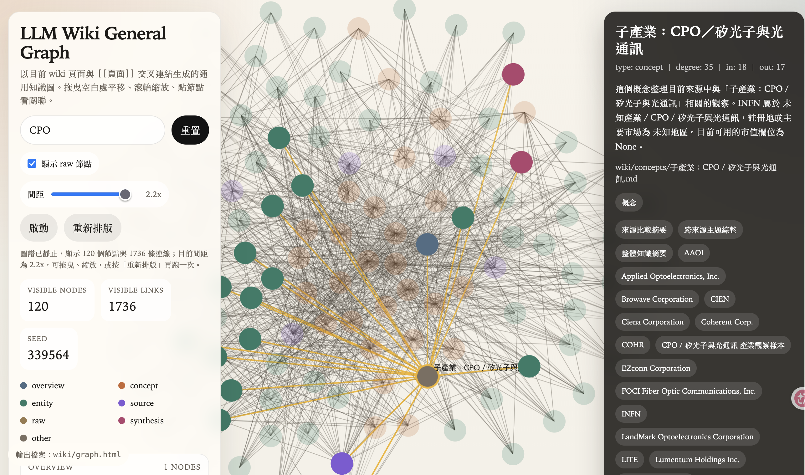

# 產業股票分析為例的 LLM Wiki Graph



### 圖中為分析半導體, CPO, 光通, 電動車, 等科技產業的台股美股之間的複雜關係所產生的 Wiki Graph, 讓我們一眼就看明白美股、台股，產業、公司，之間的複雜關係。

然後我們最後的目標當然是，一個通用、可本地運行、可逐步擴充的 LLM Wiki 工作流。
目標是把任何領域的原始資料，整理成一套可累積、可查詢、可視覺化的 Markdown 知識庫，最後長成一張知識圖。

這個 repo 是 `llm-wiki-graph` 的 general 版本。
`llm-wiki-graph` 偏金融與 Podcast 實作；這個版本則把方法抽象化，讓別人可以拿去做股票、產業研究、公司訪談、政策資料、學術摘要、產品競品、課程筆記，甚至任何可切成 `raw -> source -> concept/entity -> synthesis` 的工作流。

這套流程不只給 Codex 用。只要是會讀檔、寫檔、能跑 Python 的 code agent，都可以照同一套 SOP 來做，例如 Claude Code、Gemini CLI、Cursor agent、Aider，或你之後換成其他本地 / 雲端代理工具也一樣能套用。

## 為什麼這個 repo 有機會提升價值？

大多數「第二大腦」專案只有資料收集，沒有知識沉澱。
大多數「RAG」專案只有檢索，沒有長期維護。
大多數「AI 摘要」專案只能回答，不能把答案變成可持續更新的知識網。

這個 repo 的定位不是聊天機器人，而是：

- 一套 local-first 的知識整理流水線
- 一套 LLM 可以遵循的 Wiki SOP
- 一套能把 raw data 變成 linked knowledge graph 的骨架
- 一套讓人類與 agent 可以共同維護的 Markdown knowledge base
- 一套可被不同 code agent 共用的標準化 ingest / graph 流程

簡單說，這不是「再一個筆記工具」，而是「讓 LLM 幫你長期經營自己的知識圖譜」。

## 核心概念

整個系統的資料流如下：

```text
raw/*.json
  -> wiki/sources/*.md
  -> wiki/concepts/*.md
  -> wiki/entities/*.md
  -> wiki/synthesis/*.md
  -> wiki/index.md / wiki/overview.md / wiki/log.md
  -> wiki/graph.html
```

這五種頁面是整個系統的骨架：

- `source`：單一來源的摘要頁
- `concept`：抽象知識、方法論、主題頁
- `entity`：人物、公司、產品、技術、事件、地點、法規、組織
- `synthesis`：跨來源整理後的洞察頁
- `overview`：整個 wiki 目前長什麼樣

## 這個 repo 適合哪些使用場景

- 股票與產業研究
- Podcast / YouTube / 訪談知識庫
- 企業內部研究報告歸檔
- 競品觀察與市場情報
- 法規與政策演變整理
- 學術論文閱讀與概念圖譜
- 個人學習型 wiki
- 團隊共用研究底稿

## 目錄結構

```text
llm-wiki-general/
├── CLAUDE.md
├── README.md
├── pyproject.toml
├── raw/
├── examples/
│   └── yfinance_to_raw.py
└── wiki/
    ├── index.md
    ├── log.md
    ├── overview.md
    ├── concepts/
    ├── entities/
    ├── sources/
    └── synthesis/
```

## 從零開始建立一個新的 General Wiki

### Step 1. Clone repo

```bash
git clone <your-repo-url> llm-wiki-general
cd llm-wiki-general
```

### Step 2. 用 uv 建立環境

這個 repo 的 Python 執行與套件管理統一用 `uv`。

```bash
uv sync
```

如果你之後要加依賴：

```bash
uv add 套件名
```

如果你要移除依賴：

```bash
uv remove 套件名
```

如果你只是想執行指令，不要手動 activate 環境，直接：

```bash
uv run python ...
```

## Step 3. 建立 wiki 基本頁

第一次使用時，請至少建立：

- `wiki/index.md`
- `wiki/log.md`
- `wiki/overview.md`

你可以先用下面這個最小版本：

### `wiki/index.md`

```md
# Wiki Index

最後更新：YYYY-MM-DD｜共 0 頁

## 總覽（overview）
- [[整體知識摘要]] — 尚未開始整理

## 概念（concepts/）
（尚無頁面）

## 實體（entities/）
（尚無頁面）

## 文件摘要（sources/）
（尚無頁面）

## 分析與洞察（synthesis/）
（尚無頁面）
```

### `wiki/log.md`

```md
# Wiki Log
```

### `wiki/overview.md`

```md
---
title: 整體知識摘要
type: overview
tags: [總覽]
created: YYYY-MM-DD
updated: YYYY-MM-DD
sources: []
---
# 整體知識摘要

這個 wiki 尚未開始 ingest 資料。

## 相關頁面
- [[整體知識摘要]]
```

## Step 4. 準備 raw data

這套方法最重要的是先把原始資料標準化。

推薦的 raw JSON 結構：

```json
{
  "episode": "資料標題",
  "podcast_name": "來源名稱",
  "date": "2026-04-08",
  "insights": [
    {
      "type": "macro",
      "content": "這一段 insight 的主要內容",
      "tickers": ["NVDA", "TSM"],
      "key_points": ["補充重點 1", "補充重點 2"]
    }
  ]
}
```

這個 schema 的好處是很強：

- `episode` 給 source page 命名
- `podcast_name` 或來源名幫助建立 source / entity 關聯
- `date` 讓 wiki 可以追蹤時間
- `insights[]` 讓 LLM 不需要每次都重新理解整篇原文
- `type` 幫助自動把 insight 分流到 strategy / macro / stock / sector / personal 等概念層
- `tickers` 幫助自動建立公司或標的 entity
- `key_points` 保留細節，避免只剩一句抽象總結

## Step 5. 跑第一次小樣本 ingest

如果你是全新的領域，不要一開始就整批丟。
正確順序是：

1. 先挑 1 到 3 份代表性 raw
2. 用 Codex 依 CLAUDE.md 逐份 ingest
3. 先確認 concept / entity 命名是否合理
4. 再把這套命名規則固化成腳本
5. 最後才整批 ingest

### 建議給 Codex 的第一次 prompt

```text
請先讀 CLAUDE.md 和 README.md。
我現在要建立一個新的領域 wiki，請不要直接批次 ingest。
先從 raw/ 中挑 1 到 3 份代表性資料，依照 CLAUDE.md 的 SOP 做手動 ingest。
先幫我整理 canonical concept / entity 命名，等我確認格式後，再考慮自動化與批次 ingest。
```

## Step 6. 當命名穩定後再自動化

當你已經有一小批人工確認過的頁面後，就可以開始做自動化腳本，例如：

- 批次 ingest 腳本
- graph builder
- lint 工具
- query / synthesis 生成器

你可以直接參考 `llm-wiki-graph` 的設計，把這些能力抽成通用版本。

## 一次看懂整個工作流

### A. 新增 raw data 時

1. 把 JSON 放進 `raw/`
2. 先叫 Codex 讀 `CLAUDE.md` 和 `README.md`
3. 如果是新領域：先做 1 到 3 份手動 ingest
4. 如果是已成熟領域：可直接批次 ingest
5. 更新 `wiki/index.md`、`wiki/log.md`、`wiki/overview.md`
6. 重新生成 graph

### B. 使用者 query 時

1. 先讀 `wiki/index.md`
2. 找出相關 concept / entity / synthesis / source
3. 綜合回答
4. 如果答案有長期價值，存回 `wiki/synthesis/`

### C. 定期維護時

1. 做 lint
2. 找孤立頁面
3. 合併重複 concept
4. 修正 entity 命名漂移
5. 補新來源
6. 重建 graph

## 用 yfinance 做一個股票產業案例

這個 repo 最容易被大家拿來用的案例之一，就是把 `yfinance` 變成 raw data 來源。

### 為什麼 yfinance 很適合當 demo

- 很多人本來就在做股票研究
- 資料容易取得
- 容易做出公司 / 產業 / ETF / 主題這些 entity 與 concept
- 很適合教大家什麼叫 `raw -> wiki -> graph`

### 這個 repo 已經附了一支樣本腳本

- [examples/yfinance_to_raw.py](examples/yfinance_to_raw.py)

這支腳本會示範把幾個台股 + 美股混合 watchlist 主題轉成標準 raw JSON：

- CPO／矽光子與光通訊
- 半導體
- 記憶體
- 電動車
- 散熱
- 量子電腦

其中台股上市公司通常用 `.TW`，上櫃公司通常用 `.TWO`。量子電腦目前範例主要以美股為主，因為台股缺少純度高的代表標的。

### 第一次跑 yfinance 範例

先安裝依賴：

```bash
uv add yfinance
```

然後執行：

```bash
uv run python examples/yfinance_to_raw.py
```

執行後，`raw/` 會長出像這樣的檔案：

```text
raw/
├── 2026-04-08_CPO／矽光子與光通訊_yfinance_sample.json
├── 2026-04-08_半導體_yfinance_sample.json
├── 2026-04-08_記憶體_yfinance_sample.json
├── 2026-04-08_電動車_yfinance_sample.json
├── 2026-04-08_散熱_yfinance_sample.json
└── 2026-04-08_量子電腦_yfinance_sample.json
```

### yfinance 產業案例會長什麼樣

例如 `CPO／矽光子與光通訊` 與 `半導體` 主題，腳本會混合抓美股與台股，例如：

- `LITE`
- `COHR`
- `INFN`
- `NVDA`
- `AMD`
- `2330.TW`
- `3163.TWO`
- `3363.TWO`

轉成這種 insight：

```json
{
  "type": "stock",
  "content": "NVIDIA Corporation 屬於 Technology / Semiconductors，註冊地或主要市場為 United States。目前可用的市值欄位為 1234567890。",
  "tickers": ["NVDA"],
  "key_points": [
    "sector: Technology",
    "industry: Semiconductors",
    "country: United States",
    "market_cap: 1234567890"
  ]
}
```

這樣做的好處是：

- raw 已經是半結構化資料
- LLM 不需要從零閱讀整個網站
- 可以穩定抽出 entity，例如 `NVIDIA`、`台積電`、`波若威`
- 可以進一步長出 concept，例如 `主題：CPO／矽光子與光通訊`、`產業：Technology`、`子產業：Semiconductors`

## 如果你要改成自己的資料，怎麼做

可以，而且這本來就是這個 general repo 的重點。

最重要的原則只有一個：

- 不管原始來源是股票、Podcast、研究報告、訪談、法規、產品文檔，先把它整理成同一種 `raw JSON schema`，再交給 wiki workflow

### 最小做法

如果你只是想快速換成自己的資料，步驟是：

1. 先不要動 `wiki/`
2. 把你自己的資料轉成 `raw/*.json`
3. 每份 JSON 至少保留這幾個欄位：
   - `episode`
   - `podcast_name`
   - `date`
   - `insights[]`
4. `insights[]` 裡每筆至少要有：
   - `type`
   - `content`
5. 如果你有更好的結構化資訊，再加：
   - `tickers`
   - `entities`
   - `concepts`
   - `key_points`
6. 放進 `raw/` 後再跑：

```bash
uv run python wiki/batch_ingest.py
uv run python wiki/graph_builder.py
```

### 如果你不是股票資料，而是別的資料

也沒問題，只要照這個思路轉：

- `episode`：這份資料的標題
- `podcast_name`：來源名，不一定真的是 podcast，也可以是 `research_report`、`manual`、`policy_db`、`my_notes`
- `date`：資料日期
- `insights[]`：你從原始資料切出的重點段落

例如：

- 法規資料：`podcast_name` 可以寫成 `policy_db`
- 訪談逐字稿：`podcast_name` 可以寫成 `founder_interview`
- 內部研究筆記：`podcast_name` 可以寫成 `team_research`
- 產品文件：`podcast_name` 可以寫成 `product_docs`

### 如果你要改 `examples/yfinance_to_raw.py` 成你自己的來源

最簡單的方法不是硬改整個 repo，而是：

1. 保留 `wiki/batch_ingest.py` 和 `wiki/graph_builder.py`
2. 新建一支自己的轉檔腳本，例如：
   - `examples/podcast_to_raw.py`
   - `examples/report_to_raw.py`
   - `examples/notion_export_to_raw.py`
   - `examples/csv_to_raw.py`
3. 讓那支腳本的輸出最後都落到同一個 `raw JSON schema`

也就是說，你真正要替換的通常不是 wiki engine，而是「raw data adapter」。

### 一個最實際的心法

- `examples/yfinance_to_raw.py` 只是示範怎麼做 adapter
- 你的真實產品，應該是為自己的資料來源再寫一支 adapter
- 只要輸出 schema 一樣，後面的 ingest、index、overview、log、graph 都可以沿用

### 建議給 Codex 的 prompt

如果你要 Codex 幫你把自己的資料接進來，可以直接說：

```text
請先讀 CLAUDE.md 和 README.md。
我不要使用 yfinance，我要改成我自己的資料來源。
請先不要改 wiki engine。
先替我做一支新的 raw adapter，把我的來源轉成 README 定義的 raw JSON schema，然後再用 batch_ingest.py 與 graph_builder.py 跑完整流程。
```

## 另一個很重要的觀念：產業只是案例，骨架才是產品

如果這個 repo 要變成真正大家都能用的 GitHub 專案，關鍵不在股票，而在通用性。

所以 README 要一直強調：

- `yfinance` 只是其中一個案例
- 這套方法同樣適用於 Podcast、研究報告、法規變化、競品資料、學術論文、產品文檔
- 使用者可以把任何來源先標準化成 raw JSON，再交給 LLM Wiki SOP 處理

## 這個 repo 最終應該有哪些能力

如果你真的想把它做成爆款 repo，我建議 roadmap 長這樣：

### Phase 1. 可用骨架

- 通用 `CLAUDE.md`
- 清楚的 `README.md`
- 標準 raw schema
- 最小 wiki 結構
- 一個可理解的 demo

### Phase 2. 可重跑工具鏈

- batch ingest
- graph builder
- lint command
- synthesis generator
- query helper

### Phase 3. 多案例模板

- `examples/yfinance_to_raw.py`
- `examples/podcast_to_raw.py`
- `examples/research_report_to_raw.py`
- `examples/earnings_call_to_raw.py`

### Phase 4. 可擴散能力

- 多個 starter templates
- 更完整的 testing
- graph UI
- demo screenshots
- GitHub Actions
- 一鍵初始化新 wiki

## 給未來使用者的標準 prompt

### Prompt A：第一次建立新領域 wiki

```text
請先讀 CLAUDE.md 和 README.md。
我要用這個 repo 建立一個新的領域 wiki。
請先不要批次 ingest。
先從 raw/ 中挑 1 到 3 份代表性資料，依照 CLAUDE.md 的 Ingest SOP 建立 source / concept / entity 頁面，並替我整理 canonical naming。
等我確認命名與格式後，再進一步把規則腳本化。
```

### Prompt B：已成熟領域，直接增量 ingest

```text
請先讀 CLAUDE.md 和 README.md。
這個領域的命名規則已經穩定，請檢查 raw/ 中尚未處理的檔案，做增量 ingest，更新 wiki/index.md、wiki/log.md、wiki/overview.md，必要時產出 synthesis，最後重建 graph。
```

### Prompt C：做 lint 與重構

```text
請先讀 CLAUDE.md 和 README.md。
幫我對目前 wiki 做 lint，檢查孤立頁面、重複 concept、entity 命名漂移、缺少的互相連結、以及可能已經過時的內容。請先列出問題，再逐步修正。
```

## 推薦的公開 Repo 包裝方式

如果你要把這個 repo 包裝成讓大家一眼就懂的爆款 GitHub 專案，我建議首頁一定要有：

- 一句超清楚的定位
- 一張資料流圖
- 一個 3 分鐘能跑起來的 demo
- 一個大家秒懂的案例，例如 yfinance 產業研究
- 一段「為什麼不是又一個筆記工具」
- 一段「為什麼 LLM + Markdown + graph 比純 RAG 更有長期價值」

## 最短 Quickstart

如果使用者只願意花 1 分鐘：

```bash
uv sync
uv add yfinance
uv run python examples/yfinance_to_raw.py
```

然後告訴 Codex：

```text
請先讀 CLAUDE.md 和 README.md，然後依照 SOP 把 raw/ 裡的 yfinance 樣本整理成 wiki。
```

這樣他就能開始把資料變成可連結、可查詢、可視覺化的 wiki。

## 最後的產品定位

如果一句話總結這個 repo：

> Turn raw files into a living Markdown knowledge graph with LLM agents.

如果一句話總結它的中文價值：

> 把任何原始資料，變成一套可以持續生長的知識圖譜，而不是一次性的 AI 回答。

## 內建自動化腳本

這個通用版 repo 現在已經內建三支核心腳本：

- `wiki/batch_ingest.py`：穩定、rule-based 的標準版
- `wiki/agent_ingest.py`：真的會呼叫 Gemini API 的 LLM 版 ingestion
- `wiki/graph_builder.py`：輸出互動式知識圖

### `wiki/batch_ingest.py`

用途：

- 掃描 `raw/*.json`
- 找出尚未處理的檔案
- 建立或更新 `sources / concepts / entities / synthesis`
- 重建 `wiki/index.md`
- 重建 `wiki/overview.md`
- append `wiki/log.md`

執行方式：

```bash
uv run python wiki/batch_ingest.py
```

### `wiki/agent_ingest.py`

用途：

- 在不修改 `raw/` 的前提下，真的呼叫 Gemini 讀取每份 raw payload
- 從 `content`、`key_points`、`tickers` 推出更漂亮的主題頁與實體頁
- 先用 heuristics 補基本結構，再用 Gemini 做命名收斂與主題補強
- 適合第一次 ingest 新領域，或你想要比標準版更好的結果時使用

執行前請先設定 API key：

```bash
export GEMINI_API_KEY=你的_api_key
```

執行方式：

```bash
uv run python wiki/agent_ingest.py
```

可選模型：

```bash
export GEMINI_MODEL=gemini-2.5-flash
```

什麼時候該用它：

- 你希望第一次就有更好的概念命名
- 你的 raw 裡已經有不少 `company / theme / sector / industry / technology` 類型欄位
- 你不想自己手動先做太多 canonical naming

最簡單的選法：

- 要穩定、可預測、容易測試，而且不想用 API：用 `batch_ingest.py`
- 要一開始就追求更好結果，而且願意使用 Gemini API：用 `agent_ingest.py`

### `wiki/graph_builder.py`

用途：

- 讀取 wiki 頁面與 `[[頁面名稱]]` 交叉連結
- 把 `raw/*.json` 一起放進 graph
- 輸出互動式 `wiki/graph.html`

執行方式：

```bash
uv run python wiki/graph_builder.py
```

### 執行測試

```bash
uv run python -m unittest wiki/test_batch_ingest.py -v
uv run python -m unittest wiki/test_graph_builder.py -v
```

## 完整 Quickstart

如果你想從這個 general repo 直接跑出第一版 wiki：

```bash
uv sync
uv add yfinance
uv run python examples/yfinance_to_raw.py
export GEMINI_API_KEY=你的_api_key
uv run python wiki/agent_ingest.py   # 想要更好的第一版結果時用這個
uv run python wiki/batch_ingest.py   # 想要穩定、rule-based 結果時用這個
uv run python wiki/graph_builder.py
uv run python -m unittest wiki/test_batch_ingest.py -v
uv run python -m unittest wiki/test_graph_builder.py -v
uv run python -m unittest wiki/test_agent_ingest.py -v
```

跑完之後，重點看這幾個檔：

- `wiki/index.md`
- `wiki/overview.md`
- `wiki/log.md`
- `wiki/graph.html`
